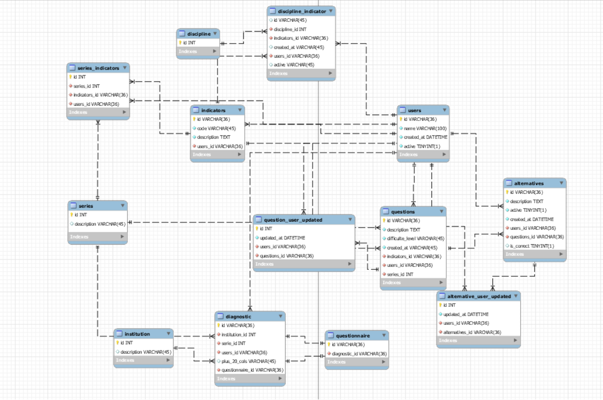

# migrate

```
php artisan migrate
```

# create a new table
```
php artisan make:migration create_questions_table
```

# to create a new table with a specific name
```
php artisan make:migration create_permissions_table --create=permissions
php artisan make:migration create_user_permissions_table --create=user_permissions
php artisan make:migration create_diagnostic_student_table --create=diagnostic_student
php artisan make:migration create_questionnaire_table --create=questionnaire
```

# to add a column to an existing table

```
php artisan make:migration add_more_five_questions_columns_to_diagnostic_student_table --table=diagnostic_student
```

# CREATE YOUR MODEL & MIGRATION
```
php artisan make:model Questionnaire
```

# CREATE CONTROLLER
```
php artisan make:controller UserController --api
```

# RUN migration
```
php artisan migrate
```

# start server

```
php artisan serve
```

# to add a jwt secret key
```
php artisan jwt:secret
```

# to enable cors
```
php artisan config:publish cors
```

# case you have a problem to generate a duplicate class name
```
php artisan cache:clear
php artisan config:clear
composer dump-autoload
```

# Modelagem do dia 30/05/2025


# Case you have a problem in production
```bash
sudo chown -R www-data:www-data /var/www/html/meu-projeto-laravel
sudo chmod -R 775 /var/www/html/meu-projeto-laravel/storage
sudo chmod -R 775 /var/www/html/meu-projeto-laravel/bootstrap/cache
```

# Case you need install redis
```bash
# Install Redis on Docker
# make sure you have docker installed
sudo apt update
sudo apt install docker.io

# Run all containers
make start 

# Install Redis on Ubuntu and Debian derivatives
sudo apt update
sudo apt install redis-server

sudo systemctl enable redis
sudo systemctl status redis

# Does not necessarily need to run this, but if you want to ensure redis is running
sudo systemctl start redis
sudo systemctl restart redis
```

# Case you want to test your cache
```bash
php artisan tinker
>>> Cache::put('foo', 'bar', 10);
>>> Cache::get('foo');
```

# When you up to production, you need to run this command to optimize your application
```bash
composer install --no-dev --optimize-autoloader
```

# Case you want to verify your container
```bash
docker exec -it <nome-do-container> redis-cli
#example
docker exec -it redis-laravel redis-cli
```

# You get an error in production?
in your .env file, change the APP_DEBUG to true to help you debug the problem
```php
APP_DEBUG=true
```

# You update the production repository? Maybe to be necessary to run these commands
```bash
composer install --no-dev --optimize-autoloader
php82 artisan migrate --force
php82 artisan config:cache
php82 artisan route:cache
```
OR
```bash
make deploy
```
